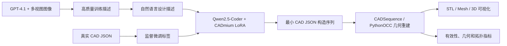

# CADmium 论文复现开发计划指南

> 研究对象：**CADmium: Fine-Tuning Code Language Models for Text-Driven Sequential CAD Design**
> 论文版本：arXiv v3（2026-01-08），已发表于 TMLR（2026-01）
> 代码基线：`chandar-lab/CADmium`，检查提交 `2b2a5e7346e17a239ffe6f4a932610bfdb9766c6`
> 规划日期：2026-08-12
> 需求来源：本项目实际存在的 `doc/需求.txt`（用户所称“研究需求.txt”）
> 文档定位：后续开发、GPU 训练、实验复现、结果验收和同学讲解的统一执行手册

---

## 1. 先说结论：本项目应该怎样复现

CADmium 的任务不是直接生成三角网格或图片，而是把一段自然语言 CAD 设计描述翻译成结构化的、可执行的 **CAD 构造序列 JSON**。随后，确定性的 CAD 几何程序把 JSON 重建为 3D 模型并导出 STL，再计算几何和拓扑指标。

完整链路可以概括为：



建议不要一开始就投入 14B 全量训练，也不要先重新调用 GPT-4.1 标注 17 万条数据。应按以下四级目标逐步推进：

| 级别 | 目标                     | 是否训练 | 主要产物                             | 通过条件                             |
| ---- | ------------------------ | -------: | ------------------------------------ | ------------------------------------ |
| R0   | 环境与几何重建最小闭环   |       否 | 真实 JSON → STL → PNG/HTML         | 固定样例能成功重建并显示             |
| R1   | 官方已训练模型推理闭环   |       否 | 文本 → JSON → STL → 可视化        | 至少 20 个样例完成，记录成功/失败    |
| R2   | 1.5B 小样本 GPU 训练闭环 |       是 | 数据下载、分词、LoRA、预测、指标     | 训练损失下降，断点可恢复，结果可复跑 |
| R3   | 论文主实验复现           |       是 | 1.5B/3B/7B/14B、完整测试集、统计图表 | 与论文同口径比较并解释误差           |

**推荐验收顺序：R0 → R1 → R2 → R3。** 这样即使最后没有足够算力完成 14B，也已经拥有可运行、可展示、可讲解的科研成果，而不是只有一次昂贵但难以定位问题的训练。

---

## 2. 论文研究方向分析

### 2.1 所属研究方向

本论文位于以下研究方向的交叉区域：

1. **文本生成 CAD（Text-to-CAD）**：用户用语言描述零件，系统生成可编辑、可重建的 CAD 设计过程。
2. **序列式 CAD 建模（Sequential CAD Design）**：将 CAD 看成按顺序执行的草图和拉伸操作，而不是仅生成最终点云或网格。
3. **代码大语言模型的领域微调**：把 CAD JSON 当作一种结构化“程序”，利用代码模型已有的语法、嵌套结构和长序列生成能力。
4. **参数高效微调（PEFT/LoRA）**：保留 Qwen2.5-Coder 基座参数，训练少量低秩适配器参数。
5. **3D 几何与拓扑评价**：不仅判断 JSON 是否能解析，还评价形状、曲面、孔洞、连通分量和网格闭合情况。

### 2.2 论文要解决的核心问题

传统 CAD 建模依赖专业人员逐步绘制草图、设置约束并执行拉伸等操作，耗时且学习门槛高。已有 Text-to-CAD 方法仍有两个关键瓶颈：

- CAD 数据缺少自然、简洁且几何信息充分的文本标注；
- 许多方法为 CAD 序列专门设计向量表示和嵌入层，没有充分利用预训练代码大模型的结构化生成能力。

CADmium 的基本答案是：

- 用 GPT-4.1 结合最小 JSON 和最多 10 个视角图像，给 DeepCAD 样本生成高质量专家级描述；
- 把“文本描述 → CAD JSON”统一成标准文本到文本的自回归生成任务；
- 用 Qwen2.5-Coder 作为基座，通过 LoRA 进行监督微调；
- 用 CAD 程序把生成 JSON 重建为 3D 模型，并引入更丰富的几何、曲率和拓扑指标。

### 2.3 论文的主要贡献与研究意义

| 贡献           | 具体内容                                                                  | 研究意义                                               |
| -------------- | ------------------------------------------------------------------------- | ------------------------------------------------------ |
| 高质量数据     | 对 DeepCAD 的 176,017 个对象重新生成专家级描述，并额外标注 Fusion360 数据 | 缓解文本—几何对齐数据不足问题                         |
| 文本到文本建模 | 将 CAD 历史表示为最小 JSON，无需新建专用 CAD embedding                    | 直接复用代码大模型的先验能力，降低方法定制成本         |
| 多尺度模型实验 | 比较 Qwen2.5-Coder 1.5B、3B、7B、14B                                      | 分析模型规模对有效性和几何质量的影响                   |
| 新评价指标     | SD、DMCD、EECM、Watertightness                                            | 从整体形状、局部曲率和拓扑结构评价 CAD，不只看点云距离 |
| 人类提示泛化   | 在 CADPrompt 的 200 条专家人工提示上测试                                  | 证明模型不只会拟合机器生成描述                         |

这项工作的价值不只是“生成一个看起来像的 3D 图”。它输出的是一系列可解释的参数化构造步骤，理论上更接近工程 CAD 的可编辑性、可追溯性和制造流程。与此同时，论文也证明了代码大模型可以迁移到结构化工程设计任务，这为后续加入倒角、圆角、旋转、扫掠和约束求解提供了扩展方向。

### 2.4 论文结论的边界

复现和讲解时必须明确以下边界，避免夸大结论：

- 当前主要支持草图中的直线、圆、圆弧，以及拉伸和布尔操作；不等同于完整工业 CAD 系统。
- 论文明确指出目前不支持倒角、圆角等高级特征。
- 训练描述是专家级、参数明确的文本；对“帮我设计一个好看的杯子把手”这类模糊功能性描述，泛化能力有限。
- 论文的大规模标注质量主要通过 LLM-as-a-judge 评价，缺少大规模真人评价，可能存在评审模型偏好。
- 指标只描述特定几何或拓扑性质，不代表可制造性、力学性能或实际工程可用性。

---

## 3. 各模型和组件对论文的作用

### 3.1 GPT-4.1：数据标注模型，不是最终生成模型

GPT-4.1 接收最小 CAD JSON 和最多 10 张 Blender 多视图图像，生成自然且几何精确的描述。它解决的是训练语料质量问题。

- **输入**：已有 CAD 构造序列、多个视角的渲染图。
- **输出**：专家级自然语言描述。
- **作用**：建立描述与 CAD 构造历史之间的监督配对。
- **复现策略**：第一阶段直接使用公开的 `CADmium-ds`，不重新调用 GPT-4.1。只有在复现数据标注实验或研究标注质量时，才运行 `annotate.py`。
- **原因**：重新标注会产生明显 API 成本；论文报告总输入输出超过 6 亿 token，而且标注结果还可能随模型服务版本变化。

### 3.2 Qwen2.5-Coder-Instruct：核心生成基座

论文选择 1.5B、3B、7B、14B 四种规模的 Qwen2.5-Coder-Instruct。代码模型适合本任务，是因为 CAD JSON 具有以下类似代码的特点：

- 严格的键名、括号、层级和数据类型；
- `part → face → loop → line/arc/circle → extrusion` 的嵌套结构；
- 前后字段必须保持一致，坐标和操作顺序存在依赖；
- 输出需要可以被程序解析和执行，而不仅是语义大致正确。

模型本身负责从文本预测 JSON token，不负责网格构建、渲染或计算指标。

### 3.3 CADmium LoRA 适配器：把通用代码模型变成 CAD 生成模型

Hugging Face 上的 `CADmium-1.5B/3B/7B/14B` 从文件大小和 `adapter_config.json` 可知是 **LoRA 适配器仓库**，不是包含全部基座权重的独立模型。推理时必须同时具备：

1. 对应规模的 `Qwen/Qwen2.5-Coder-*-Instruct` 基座；
2. 对应的 CADmium LoRA adapter；
3. 与训练一致的 tokenizer 和对话模板。

LoRA 对线性层的权重更新可写为：

\[
W' = W + \Delta W, \qquad \Delta W = \frac{\alpha}{r}BA
\]

其中原权重 \(W\) 冻结，只训练低秩矩阵 \(A\) 和 \(B\)。论文设置秩 \(r=64\)，并描述 \(\alpha=32\)；但当前仓库 `train.yaml` 以及四个已发布 adapter 的 `adapter_config.json` 都写的是 `lora_alpha: 16`。这说明公开权重更接近 alpha=16 的代码口径，但论文口径仍是 alpha=32。这是必须记录和消融的复现歧义，不能悄悄选择其中一个。

### 3.4 CADSequence、PythonOCC、Trimesh：确定性的几何执行与评价层

这一层不是神经网络，但它决定生成结果能否变成真实 3D 对象：

- 解析最小 JSON；
- 恢复草图的线、圆、圆弧和坐标系；
- 执行拉伸及 New/Join/Cut/Intersect 操作；
- 生成 mesh/STL；
- 采样点云并计算 Chamfer Distance；
- 计算 watertightness、Euler characteristic、mean curvature 等。

因此，JSON 语法正确不等于几何有效。复现实验必须把“文本生成成功”“JSON 解析成功”“CAD 重建成功”“网格满足指标条件”分成不同状态记录。

### 3.5 Text2CAD：关键对照模型

Text2CAD 使用专门的向量化 CAD 表示、冻结 BERT 文本编码器以及带交叉注意力的 Transformer 解码器。它具有更强的 CAD 结构归纳偏置，论文中往往能获得较低的无效率和较好的某些网格指标；CADmium 则在多个构造元素 F1、部分形状指标和扩展灵活性方面有优势。

讲解时可以把二者对比为：

| 维度       | Text2CAD                    | CADmium                       |
| ---------- | --------------------------- | ----------------------------- |
| 表示       | 专门设计的 CAD 向量         | 人类可读的最小 JSON           |
| 主模型     | 专用文本编码器 + CAD 解码器 | 通用预训练代码 LLM            |
| 结构约束   | 强，通常更容易生成有效序列  | 较弱，可能生成非法 JSON/几何  |
| 扩展操作   | 需要改向量词表和结构        | 可扩展 JSON schema 后继续微调 |
| 解释和调试 | 依赖专用表示                | JSON 更直观                   |

---

## 4. 数据集、样本格式与数据流

### 4.1 主要数据集

| 数据集       | 用途                                   | 样本规模/划分                                      |     是否用于训练 |
| ------------ | -------------------------------------- | -------------------------------------------------- | ---------------: |
| CADmium-ds   | DeepCAD 样本的高质量文本—JSON 对      | train 118,299；validation 8,925；test 8,046        |               是 |
| Fusion360-ds | 跨数据源泛化                           | 论文标注 8,307 个对象；HF 当前提供 validation 分片 | 主要用于泛化评价 |
| CADPrompt    | 200 条人工专家提示                     | 200                                                |       否，只测试 |
| Text2CAD     | 基线训练和评价、原始最小 JSON/渲染资源 | 论文沿用其过滤划分                                 |         基线使用 |

公开 `CADmium-ds` 每条数据至少包含：

```text
uid         : 样本唯一标识，如 0026/00267571
annotation  : 自然语言 CAD 设计描述，即模型输入
json_desc   : 最小 CAD JSON 字符串，即监督训练目标
```

### 4.2 最小 JSON 的逻辑层次

```text
parts
└── part_1, part_2, ...
    ├── coordinate_system
    │   ├── Euler Angles
    │   └── Translation Vector
    ├── sketch
    │   └── face_1, face_2, ...
    │       └── loop_1, loop_2, ...
    │           ├── line_n: Start Point / End Point
    │           ├── arc_n: Start Point / Mid Point / End Point
    │           └── circle_n: Center / Radius
    └── extrusion
        ├── extrude_depth_towards_normal
        ├── extrude_depth_opposite_normal
        ├── sketch_scale
        └── operation
```

### 4.3 分词与监督信号

代码使用 Qwen 对话模板构造：

```text
[SYSTEM]  输出 CAD JSON 的 schema 和规则
[USER]    annotation
[ASSISTANT] json_desc
```

训练采用自回归交叉熵，原则上只对 assistant 的 JSON token 计算损失：

\[
\mathcal{L}=-\sum_{t \in \text{assistant}}\log p_\theta(y_t\mid y_{<t},x)
\]

需要特别检查当前 `tokenize_dataset.py`：它屏蔽了 assistant 标记之前的 label，但固定补齐到 4096 后没有显式把 padding label 改为 `-100`。严格复现分支应保留原实现；修正版分支应屏蔽 padding，并把两者作为一个明确的消融实验。

### 4.4 数据质量检查

每次正式训练前生成 `reports/data_audit.json` 和图表，至少检查：

- train/validation/test 的行数和 uid 唯一性；
- 三个划分之间 uid 是否交叉；
- `annotation`、`json_desc` 是否为空；
- JSON 解析成功率；
- token 长度分布以及超过 4096 被截断的比例；
- part、face、loop、line、arc、circle、extrusion 数量分布；
- 四类 operation 的频次；
- 随机抽取 20 条进行 JSON → STL 重建；
- 保存数据文件 SHA256，保证以后使用同一数据快照。

注意：Hugging Face 仓库本身是 Parquet 文件，而官方脚本使用 `load_from_disk()`。因此不能只把仓库文件下载到 `data/cadmium_ds` 就假定脚本可读。应先用 `load_dataset()` 获取，再调用 `save_to_disk()` 生成 Hugging Face Dataset 的本地目录格式。

---

## 5. 训练方法和论文超参数

### 5.1 论文报告的设置

| 项目            | 论文设置                                    |
| --------------- | ------------------------------------------- |
| 基座            | Qwen2.5-Coder-Instruct 1.5B / 3B / 7B / 14B |
| 训练方式        | SFT + LoRA                                  |
| LoRA target     | 所有线性层                                  |
| LoRA rank       | 64                                          |
| LoRA alpha      | 论文写 32；仓库配置写 16，需双轨记录        |
| 优化器          | AdamW，β1=0.9，β2=0.999，ε=1e-8          |
| 学习率          | 峰值 2e-4，余弦衰减到 0                     |
| warmup          | 100 steps                                   |
| epoch           | 最多 4                                      |
| 最大长度        | 4096 tokens                                 |
| 精度            | fp16                                        |
| 分布式          | FSDP FULL_SHARD                             |
| 原始硬件        | 4 × NVIDIA A100 80GB                       |
| 有效 batch size | 16                                          |
| 训练时长        | 每个规模约 8–12 小时                       |
| 解码            | greedy，`do_sample=False`                 |

有效 batch size 的计算为：

\[
B_{effective}=B_{device}\times N_{GPU}\times N_{accumulation}
\]

官方默认是每卡 4、4 卡、累积 1，因此有效 batch 为 16。更换 GPU 数量时，不仅要维持这个数，还要考虑 4096 长序列引起的激活显存；不能简单地在单卡上把 batch 改成 16。

### 5.2 训练中必须记录的曲线

- `train/loss`、`eval/loss`；
- learning rate；
- gradient norm；
- GPU 显存峰值和 GPU 利用率；
- 每秒样本数、每秒 token 数；
- 每个 epoch/step 的耗时；
- 可解析 JSON 比例；
- 可重建 mesh 比例；
- 固定验证提示的生成结果。

仅报告 loss 不足以证明 CAD 模型变好。建议每 500 或 1000 step 对固定 20 条验证样本生成一次，并记录 JSON 合法率和重建成功率。

---

## 6. 评价指标及其论文意义

### 6.1 基础有效性与构造元素指标

| 指标                   | 趋势 | 含义                             | 为什么需要                   |
| ---------------------- | ---: | -------------------------------- | ---------------------------- |
| IR（Invalidity Ratio） |   ↓ | 无法成功转为有效 CAD mesh 的比例 | 首先判断结果是否可用         |
| Line F1                |   ↑ | 直线构造匹配程度                 | 判断草图边界是否正确         |
| Arc F1                 |   ↑ | 圆弧匹配程度                     | 判断弯曲局部结构             |
| Circle F1              |   ↑ | 圆匹配程度                       | 判断孔、圆柱等结构           |
| Extrusion F1           |   ↑ | 拉伸操作匹配程度                 | 判断 2D 草图到 3D 的关键操作 |

F1 由 precision 和 recall 的调和平均得到：

\[
F1=\frac{2PR}{P+R}
\]

### 6.2 几何与网格指标

| 指标                   | 趋势 | 含义                         |
| ---------------------- | ---: | ---------------------------- |
| CD（Chamfer Distance） |   ↓ | 预测点云与真实点云的距离     |
| SegE                   |   ↓ | 预测与真实模型线段数量差异   |
| DangEL                 |   ↓ | 未被足够面共享的悬空边总长度 |
| SIR                    |   ↓ | 网格面自相交比例             |
| FluxEE                 |   ↓ | 网格包围封闭体积的误差       |
| Watertightness         |   ↑ | 预测网格为闭合水密网格的比例 |

论文指出 CD 容易被少量极端离群值影响，因此同时报告 mean 和更稳健的 median。绘图时建议使用对数横轴或截尾视图，并保留原始全量数据。

### 6.3 CADmium 新增指标

**球形度差异 SD**：比较预测与真实对象的整体紧凑程度。

\[
\Psi=\frac{\pi^{1/3}(6V)^{2/3}}{S}, \qquad
SD=|\Psi_{pred}-\Psi_{gt}|
\]

其中 \(V\) 是体积，\(S\) 是表面积。SD 越低，整体形状紧凑性越相似。

**离散平均曲率差 DMCD**：比较预测和真实 mesh 顶点处离散平均曲率的均值差异，越低表示曲面几何越接近。

\[
DMCD=|\bar{\kappa}_{pred}-\bar{\kappa}_{gt}|
\]

**Euler 特征精确匹配 EECM**：

\[
\chi=V-E+F,\qquad EECM=\mathbf{1}[\chi_{pred}=\chi_{gt}]
\]

它用于检查孔洞、连通分量等基本拓扑是否一致。

### 6.4 指标计算的公平性要求

EECM、DMCD 和 SD 只有在预测与真实 mesh 都 watertight 时才能可靠计算。不同模型可能产生不同数量的有效 mesh，因此必须同时报告：

1. 各模型自己的全部有效子集结果；
2. 所有模型共同有效样本的交集结果；
3. 每个指标实际参与计算的样本数 `n`；
4. 95% 置信区间；
5. 显著性检验及 Benjamini–Hochberg 多重比较校正。

如果只比较“各自有效样本”的平均指标，可能出现差模型丢掉困难样本后均值反而更好的选择偏差。

### 6.5 论文结果的参考锚点

复现时不要求每个数字完全一致，但应先确认数量级、趋势和统计口径。论文在 CADmium test 上报告：

| 模型规模 | IR（↓） | Line F1（↑） | Arc F1（↑） | Circle F1（↑） | Extrusion F1（↑） | Watertightness（↑） |
| -------: | -------: | ------------: | -----------: | --------------: | -----------------: | -------------------: |
|     1.5B |   11.86% |          0.90 |         0.70 |            0.87 |               0.98 |               90.38% |
|       3B |    8.51% |          0.91 |         0.74 |            0.91 |               0.98 |               90.31% |
|       7B |    5.93% |          0.91 |         0.73 |            0.89 |               0.98 |               90.54% |
|      14B |    3.33% |          0.92 |         0.78 |            0.92 |               0.99 |               90.78% |

主要趋势是模型变大后 IR 明显下降，构造元素 F1 总体提高；但并非每项指标都随规模严格单调改善。因此讲解时不能简单说“模型越大所有指标都越好”。

---

## 7. 当前机器和 GPU 可行性分析

### 7.1 本机检查结果

2026-08-12 实际检查到：

```text
GPU: NVIDIA GeForce GTX 1050 Ti
显存: 4096 MiB
驱动: 581.57
Python: 3.10.6
Conda: 未安装或命令不可用
Git: 2.46.1.windows.1
```

结论：**本机 GTX 1050 Ti 4GB 不适合按论文配置训练 CADmium，即便 1.5B 的官方 fp16 + 4096 长度 LoRA 也不应以此为正式方案。** 本机适合文档、数据抽样、轻量脚本开发、CPU 几何重建，以及在降低长度/量化后做有限推理试验；正式 GPU 训练应使用 Linux 云服务器或实验室服务器。

### 7.2 建议 GPU 分层

| 场景                  | 建议硬件                            | 说明                                                      |
| --------------------- | ----------------------------------- | --------------------------------------------------------- |
| R0 几何重建           | CPU，16GB+ RAM                      | 不训练模型                                                |
| R1 1.5B 推理          | 建议 12GB+ GPU；4bit 可尝试更低显存 | 4GB 本机不作为稳定验收环境                                |
| R2 1.5B 小样本 LoRA   | 1 × 24GB GPU 起步                  | batch=1、梯度累积、gradient checkpointing；属于资源优化版 |
| R2 1.5B/3B 较完整训练 | 1 × 48GB 或 80GB GPU               | 先实测峰值再扩数据                                        |
| R3 论文严格复现       | 4 × A100 80GB                      | 与论文硬件、FSDP 和有效 batch 对齐                        |
| R3 14B 完整训练       | 4 × A100/H100 80GB                 | 不建议在消费级单卡上硬做                                  |

上表中非论文硬件只是工程估算，实际显存受 `transformers/trl/peft` 版本、attention 实现、序列长度、batch、是否保存激活和 FSDP 策略影响。任何付费长任务前必须先运行 20 step 显存压力测试。

### 7.3 服务器建议

- 操作系统：Ubuntu 22.04 或同级 Linux；正式训练不以原生 Windows 为主环境。
- 系统内存：小规模至少 64GB；多卡完整训练建议 128GB 以上。
- 磁盘：至少预留 200GB；14B、多 checkpoint、预测 JSON、STL 和中间指标建议 500GB 以上。
- GPU 互联：多卡优先 NVLink/NVSwitch；避免仅靠低带宽 PCIe 的跨机组合。
- 网络：需要下载 Qwen 基座、LoRA adapter、数据集和 Python/Conda 包。
- 成本控制：先完成 R1，再租单卡做 20-step smoke test，最后才申请多卡长任务。

### 7.4 云服务器能否替代本地 GPU

**可以，而且这是当前机器条件下的推荐方案。** 云服务器能够完整承担“官方 1.5B 批量推理验证”和“小样本 LoRA/QLoRA 训练”，本机继续承担数据抽样、代码开发、结果下载、CPU 几何重建、指标汇总和文档整理。这样既绕开 GTX 1050 Ti 4GB 的显存限制，又不必长期购买高端显卡。

需要明确“替代”的边界：

| 工作                            | 本机               | 云服务器                      | 推荐分工                       |
| ------------------------------- | ------------------ | ----------------------------- | ------------------------------ |
| 数据抽样、JSON 审计、脚本开发   | 适合               | 也可                          | 本机完成并提交版本控制         |
| 官方 1.5B 模型批量推理          | 不适合作为正式环境 | 适合                          | 云端一次加载模型后批量运行     |
| 512～2000 条小样本训练          | 4GB 无法稳定完成   | 24GB 可做 QLoRA/缩短长度 LoRA | 云端完成                       |
| 原论文 fp16、4096 长度 LoRA     | 不可行             | 24GB 不保证；48GB/80GB 更稳妥 | 更大显存云服务器               |
| 4 卡严格复现                    | 不可行             | 可租 4 × A100 80GB           | 仅在单卡闭环全部通过后进行     |
| OpenCascade 几何重建和 STL 检查 | CPU 可完成         | 可选                          | 下载预测 JSON 后在本机重建     |
| 结果、日志、checkpoint 长期保存 | 适合               | 临时盘存在风险                | 云端运行，本机和对象存储双备份 |

因此，下一阶段采用以下口径：

1. **24GB 云 GPU 是开发与验证下限，不等于论文严格复现硬件。**
2. 官方 1.5B adapter 的推理先用 fp16/bf16，不主动量化，以免把量化误差混入官方模型验证。
3. 24GB 上的小样本训练默认采用 4bit QLoRA；结果必须标记为“资源优化实验”，不能冒充论文原始 fp16 LoRA。
4. 若必须使用 fp16、4096 长度并尽量保持论文训练口径，升级到 48GB 或 80GB 单卡；全量、多尺度训练再考虑多卡。

### 7.5 云平台选择和推荐配置

云平台不绑定某一家，选择时优先检查 GPU 型号、显存、磁盘是否持久化、关机后是否继续收取磁盘费、能否保存镜像、网络下载 Hugging Face 是否稳定。可采用两类方案：

- **国内算力租赁平台（适合本课题起步）**：例如 AutoDL 一类按量平台，开机计费、关机停止 GPU 计费，创建门槛低，适合 20 step 和数小时的小实验。按量实例关机后通常不保留 GPU 占用，再开机时可能无卡；数据盘仍可能持续计费，且本地盘不能代替备份。
- **通用公有云 GPU（适合需要稳定资源和对象存储时）**：例如腾讯云 GPU 云服务器。可选按量、包周期或竞价实例，并配合云硬盘、快照和对象存储。运维项和总成本通常更多，但适合连续训练、团队共享和正式实验。

购买页面的价格和库存变化较快，本指南不写死每小时价格。下单前以平台实时价格计算：

```text
总成本 = GPU 实例单价 × 实际开机时长
       + 云硬盘/数据盘保留费用
       + 快照或对象存储费用
       + 必要的公网流量费用
```

#### 下一阶段首选规格

| 项目   | 最低可用                       | 推荐                                  | 何时升级                                        |
| ------ | ------------------------------ | ------------------------------------- | ----------------------------------------------- |
| GPU    | RTX 4090 24GB、A10 24GB 或同级 | RTX 4090 24GB                         | fp16/4096 OOM 时换 A6000/L40S 48GB 或 A100 80GB |
| CPU    | 8 vCPU                         | 12～16 vCPU                           | 分词或数据加载成为瓶颈时                        |
| 内存   | 32GB                           | 64GB                                  | 全量数据预处理或多进程重建时                    |
| 数据盘 | 100GB                          | 200GB SSD                             | 保留多个 checkpoint 或全量结果时                |
| 系统   | Ubuntu 22.04                   | Ubuntu 22.04 + 预装 PyTorch/CUDA 镜像 | 不建议以 Windows 云主机做正式训练               |
| 网络   | 能访问代码、模型和 Python 包源 | 可配置 Hugging Face/镜像源            | 下载经常中断时使用本机上传或对象存储            |

磁盘预算不能只计算 3GB 左右的基座模型，还要包含 adapter、Python/CUDA 环境、原始数据、tokenized Parquet、训练状态、checkpoint、预测 JSON 和日志。首轮 200GB 足够从容；若只购买 100GB，必须限制 checkpoint 数量并及时导出结果。

### 7.6 云端迁移前的本机准备

本阶段不要把 `.venv`、缓存目录和可重新下载的大模型直接打包上传。源代码、配置、固定样本和文档进入版本控制，大模型在云端按固定 revision 下载。

#### 7.6.1 冻结本地版本

在 PowerShell 中执行：

```powershell
cd E:\code\论文复现
git -C .\CADmium rev-parse HEAD
python .\scripts\check_environment.py --json-output .\reports\environment_before_cloud.json
Get-FileHash .\data\samples\test_sample.jsonl -Algorithm SHA256
```

把以下信息写入 `experiments/cloud_1p5b/manifest.md`：

- 官方仓库 commit；
- 基座模型和 adapter 的仓库名、revision、文件 SHA256；
- 固定测试集的 SHA256 和 uid 列表；
- 本次计划使用的 GPU、CUDA、PyTorch 和 Python 版本；
- 严格实验还是资源优化实验。

#### 7.6.2 打包需要上传的文件

如暂时不使用 Git 远端仓库，可生成一个轻量迁移包：

```powershell
cd E:\code\论文复现
tar.exe -czf .\cadmium_gpu_stage.tar.gz `
  --exclude=.venv --exclude=.cache --exclude=models --exclude=reports `
  .\CADmium .\configs_repro .\scripts .\tests .\data\samples .\doc .\requirements-local.txt
Get-FileHash .\cadmium_gpu_stage.tar.gz -Algorithm SHA256
```

上传方式任选其一：平台网页/Jupyter 上传、`scp`、Git 私有仓库或对象存储。使用 SSH 时示例为：

```powershell
scp .\cadmium_gpu_stage.tar.gz root@<服务器IP>:/root/autodl-tmp/
```

不要把 Hugging Face token、云平台密钥、SSH 私钥或 W&B key 写进脚本和仓库；凭据仅通过环境变量或平台密钥管理功能提供。

### 7.7 云服务器初始化操作

以下以 Ubuntu 和 `/root/autodl-tmp` 数据盘为例；其他平台只需替换工作目录。先在控制台确认实例确实分配了至少 24GB 显存，再连接 SSH。

#### 7.7.1 硬件与磁盘验收

```bash
nvidia-smi
nvidia-smi --query-gpu=name,memory.total,driver_version --format=csv
python3 --version
df -h
free -h
```

任何一项不满足订单规格都不要开始下载模型。将上述输出保存为首份实验证据：

```bash
mkdir -p /root/autodl-tmp/paper-repro/experiments/cloud_1p5b
nvidia-smi > /root/autodl-tmp/paper-repro/experiments/cloud_1p5b/nvidia-smi.txt
```

#### 7.7.2 解压代码与创建隔离环境

```bash
cd /root/autodl-tmp
mkdir -p paper-repro
tar -xzf cadmium_gpu_stage.tar.gz -C paper-repro

python3 -m venv /root/autodl-tmp/venvs/cadmium
source /root/autodl-tmp/venvs/cadmium/bin/activate
python -m pip install --upgrade pip setuptools wheel
```

优先选平台已经验证过的 PyTorch/CUDA 镜像。若自行安装，应先选定与驱动兼容的 CUDA wheel，例如：

```bash
pip install torch==2.6.0 torchvision==0.21.0 \
  --index-url https://download.pytorch.org/whl/cu124
pip install -r /root/autodl-tmp/paper-repro/requirements-gpu.txt
```

`requirements-gpu.txt` 是本阶段需要新增并锁定的文件，至少包含 `transformers`、`peft`、`accelerate`、`datasets`、`trl`、`bitsandbytes`、`hydra-core` 和项目几何依赖。首次成功后立即执行：

```bash
pip freeze > /root/autodl-tmp/paper-repro/experiments/cloud_1p5b/pip-freeze.txt
```

#### 7.7.3 验证 PyTorch 真正使用 GPU

```bash
python - <<'PY'
import torch
print("torch:", torch.__version__)
print("cuda available:", torch.cuda.is_available())
print("cuda runtime:", torch.version.cuda)
print("gpu:", torch.cuda.get_device_name(0))
print("vram GiB:", round(torch.cuda.get_device_properties(0).total_memory / 1024**3, 2))
x = torch.randn(2048, 2048, device="cuda", dtype=torch.float16)
y = x @ x
print("smoke:", y.shape, y.device, torch.isfinite(y).all().item())
PY
```

只有 `cuda available: True`、显卡型号正确且矩阵运算通过，才进入模型下载。否则先处理驱动、镜像或 PyTorch CUDA 版本问题，不能靠继续安装随机版本碰运气。

### 7.8 官方 1.5B 模型批量验证操作

#### 7.8.1 验证目标

这一轮验证的是“官方 base + 官方 adapter + 当前解码/重建管线”，不是训练效果。模型必须只加载一次并处理整批样本，不能为每条样本重新加载 3GB 基座。

本阶段需要新增 `scripts/infer_batch_gpu.py`，至少支持：

- 显式传入 base、adapter、revision 和 dtype；
- 模型只初始化一次；
- 断点续跑并跳过已完成 uid；
- 每条保存 prompt、原始回答、抽取后的 JSON、token 数、耗时和异常；
- 写入统一 `summary.json`，包含成功数、JSON 解析率、平均/分位耗时和峰值显存；
- 固定 greedy 解码，并把所有 generation 参数写入 resolved config。

#### 7.8.2 分三级扩大样本

| 级别 |      样本数 | 目的                            | 放行条件                     |
| ---- | ----------: | ------------------------------- | ---------------------------- |
| G1-A |  固定 20 条 | 验证加载、解码、JSON 保存和回传 | 20 条均被尝试，失败有状态码  |
| G1-B | 固定 200 条 | 暴露长度、超时和偶发格式问题    | 可断点续跑，未发生系统性 OOM |
| G1-C |   完整 test | 形成官方 1.5B 基线              | 重建、指标和失败分母口径固定 |

首轮建议参数为 fp16、batch size 1、输入上限 4096、生成上限 4096、greedy。A100/H100 可优先 bf16；不确定时先 fp16。示例命令如下，实际参数名以新增脚本实现为准：

```bash
cd /root/autodl-tmp/paper-repro
source /root/autodl-tmp/venvs/cadmium/bin/activate

CUDA_VISIBLE_DEVICES=0 python scripts/infer_batch_gpu.py \
  --base-model Qwen/Qwen2.5-Coder-1.5B-Instruct \
  --adapter chandar-lab/CADmium-1.5B \
  --input data/samples/test_sample.jsonl \
  --output-dir experiments/gpu_infer_1p5b_20 \
  --dtype float16 \
  --batch-size 1 \
  --max-input-tokens 4096 \
  --max-new-tokens 4096 \
  --seed 42
```

运行时另开一个 SSH 窗口监控：

```bash
watch -n 1 nvidia-smi
```

也可把监控写入文件：

```bash
nvidia-smi --query-gpu=timestamp,name,memory.used,memory.total,utilization.gpu,power.draw \
  --format=csv -l 5 > experiments/gpu_infer_1p5b_20/gpu_monitor.csv &
echo $! > experiments/gpu_infer_1p5b_20/gpu_monitor.pid
```

G1-A 完成后，先压缩并下载预测结果，在本机用现有 CPU 重建脚本执行：

```powershell
python .\scripts\reconstruct_json.py `
  --input .\experiments\gpu_infer_1p5b_20\predictions.jsonl `
  --output-dir .\reports\gpu_infer_1p5b_20_reconstruction `
  --continue-on-error
```

只有 G1-A 的原始输出保存完整、JSON 解析和 CPU 重建链路均正常，才扩到 200 条。完整 test 的验收必须报告总样本数、S0～S5 各状态数、JSON 解析率、几何重建率和 watertightness，不能只展示成功案例。

### 7.9 24GB GPU 小样本 LoRA/QLoRA 训练操作

#### 7.9.1 两种训练口径

| 口径                 | 24GB 是否推荐 | 关键配置                                                        | 结果定位                     |
| -------------------- | ------------- | --------------------------------------------------------------- | ---------------------------- |
| QLoRA 资源版         | 推荐          | base 4bit NF4、LoRA fp16/bf16、batch 1、梯度累积、checkpointing | 验证训练管线和小样本适配能力 |
| fp16 LoRA 接近论文版 | 可能 OOM      | base fp16、4096 长度、LoRA，不量化                              | 建议 48GB/80GB 后再运行      |

24GB 首轮配置建议：

```yaml
experiment: cloud_qlora_1p5b_smoke
base_model: Qwen/Qwen2.5-Coder-1.5B-Instruct
train_rows: 128
validation_rows: 64
max_length: 4096  # 本机真实 prompt/answer 审计后修正
load_in_4bit: true
bnb_4bit_quant_type: nf4
bnb_4bit_use_double_quant: true
bnb_4bit_compute_dtype: bfloat16
lora_r: 64
lora_alpha: 16
lora_dropout: 0.05
target_modules: all-linear
per_device_train_batch_size: 1
per_device_eval_batch_size: 1
gradient_accumulation_steps: 16
gradient_checkpointing: true
use_cache: false
learning_rate: 0.0002
optim: paged_adamw_8bit
max_steps: 20
save_steps: 20
eval_steps: 20
seed: 42
report_to: none
```

说明：`lora_alpha=16` 是先对齐公开代码的 smoke 口径；论文记录的 32 在流程稳定后作为对照实验。若 GPU 对 bf16 支持异常，将 `bnb_4bit_compute_dtype` 和训练精度改为 fp16，不能同时打开 bf16 和 fp16。

官方训练脚本在接收字符串形式的 `bnb_4bit_compute_dtype` 时可能需要先转换成 `torch.dtype`；本阶段应在复现层增加显式转换和单元测试，而不是直接修改来源不明的库代码。24GB 配置还必须关闭 FSDP，避免沿用 4 卡配置。

#### 7.9.2 样本和长度递进

| 训练级别 | train/val |            max length |          步数 | 目的                                    |
| -------- | --------: | --------------------: | ------------: | --------------------------------------- |
| G2-A | 先取 10/5 工程样本 | 4096 | 1 step | 验证 forward、backward、optimizer、save；不得报告模型质量 |
| G2-B | 先取 10/5 工程样本 | 4096 | 20 step | 显存压力、loss、checkpoint 验收；不得报告模型质量 |
| G2-C | 128/64 正式 train/validation | 4096 | 20～100 step | 排除 test 泄漏后的第一轮训练 smoke |
| G2-D | 512/128 | 4096，OOM 时只筛选短样本做 2048 诊断 | 100～200 step | 第一轮有意义的小样本实验 |

每次只改变一个主要变量，不能同时扩大样本、长度、LoRA rank 和 batch。数据划分按固定 uid 保存，测试 20 条不能混入训练集。

示例启动命令为：

```bash
cd /root/autodl-tmp/paper-repro/CADmium
export TOKENIZERS_PARALLELISM=false
export WANDB_MODE=offline

torchrun --standalone --nproc_per_node=1 \
  cadmium/src/train.py --config-name cloud_qlora_1.5b_smoke
```

配置文件应保存到官方 Hydra 能识别的配置目录，或由复现层显式传入；不要只在命令行临时写十几个覆盖项而不留 resolved config。

#### 7.9.3 OOM 处理顺序

发生 OOM 时按以下顺序处理并记录，不允许无记录地反复改配置：

1. 确认没有其他进程占用 GPU，`per_device_train_batch_size=1`；
2. 打开 gradient checkpointing，设置 `use_cache=false`；
3. 确认 base 以 4bit NF4 加载且 optimizer 为 8bit；
4. 4096 OOM 时，用 token audit 筛选完整长度不超过 2048 的短样本做诊断；不得直接降到 1024，因为本机已观察到 assistant 零监督样本；
5. 保持或提高梯度累积以维持有效 batch，不要把单卡 batch 再设为 0；
6. 仍不满足实验口径时，停止在 24GB 上绕行，升级到 48GB/80GB。

CPU offload 只作为诊断手段，不作为正式默认方案，因为它可能使训练极慢且引入额外内存/IO 瓶颈。

#### 7.9.4 训练验收

- `nvidia-smi` 和训练日志证明 GPU 实际参与；
- loss 为有限值，并呈总体下降趋势，不要求每一步单调；
- 峰值显存建议低于总显存的 90%，为保存和评估留余量；
- 20 step checkpoint 可单独加载，并能从 20 恢复到 40 step；
- 保存的是 adapter 和必要训练状态，不重复保存多份完整 base；
- 对固定 20 条提示推理，保存训练前/训练后的 JSON 解析率和重建率；
- 所有实验记录 `git commit`、数据 SHA256、环境、resolved config、seed、命令、耗时和费用。

### 7.10 结果回传、备份和关机

云端本地 SSD、按量实例和竞价实例都不应作为唯一存档。每个级别完成后立即生成结果包：

```bash
cd /root/autodl-tmp/paper-repro
tar -czf cloud_1p5b_results.tar.gz \
  experiments/gpu_infer_1p5b_20 experiments/cloud_1p5b outputs/cloud_qlora_1p5b_smoke
sha256sum cloud_1p5b_results.tar.gz > cloud_1p5b_results.tar.gz.sha256
```

然后下载到本机：

```powershell
cd E:\code\论文复现
scp root@<服务器IP>:/root/autodl-tmp/paper-repro/cloud_1p5b_results.tar.gz .\experiments\
scp root@<服务器IP>:/root/autodl-tmp/paper-repro/cloud_1p5b_results.tar.gz.sha256 .\experiments\
Get-FileHash .\experiments\cloud_1p5b_results.tar.gz -Algorithm SHA256
```

校验 SHA256、解压并抽查日志/checkpoint 后，才在平台控制台关机。按量实例关机后可能不再保留原 GPU，重要环境应保存镜像，重要数据还要同步到本机或对象存储；同时检查数据盘、快照是否仍在计费。

### 7.11 下一阶段五天执行安排

|      天 | 具体工作                                                     | 当日必须产出                                          |
| ------: | ------------------------------------------------------------ | ----------------------------------------------------- |
| 第 1 天 | 购买 24GB 实例、验收硬件、创建环境、下载 base/adapter        | `nvidia-smi.txt`、`pip-freeze.txt`、模型 manifest |
| 第 2 天 | 实现/运行批量脚本，完成 20 条和 200 条官方模型验证           | predictions、summary、GPU 监控、失败清单              |
| 第 3 天 | 本机 CPU 重建，修正批处理与断点续跑问题，决定是否跑完整 test | 20/200 条重建与指标报告                               |
| 第 4 天 | 1 step、20 step QLoRA，验证保存和断点恢复                    | checkpoint、loss、显存、恢复日志                      |
| 第 5 天 | 512 条/4096 长度小样本训练与前后对比；OOM 时改用筛选后的短样本做 2048 对照 | adapter、对照表、费用和实施记录                       |

决策门禁：若 G1-A 未通过，不进入 200 条；若官方模型 JSON/重建链路未通过，不训练；若 G2-B 无法恢复 checkpoint，不扩大到 512 条；若 24GB 只能通过过度缩短长度完成，则保留资源版结果并申请 48GB/80GB，而不是声称已经按论文配置复现。

### 7.12 2026-08-12 本机剩余编码复查和完成情况

再次盘点后，发现云端计划中仍有一批**不需要 GPU、应当在租服务器前完成**的工作。现已完成以下实现：

| 新增或增强文件 | 本机已完成内容 | 当前验证结果 |
|---|---|---|
| `scripts/infer_batch_gpu.py` | 官方 base + adapter 一次加载、逐 uid 保存、断点续跑、原始回答、JSON 抽取、耗时与汇总；提供本机 `--dry-run` | 20 个固定 uid、路径和参数检查通过；真实 CUDA 加载待云端 |
| `scripts/prepare_lora_subset.py` | 确定性、分类均衡切分；输出 JSONL、Parquet、token audit；prompt 和 padding label 均置为 `-100` | 10/5/5 工程切分完成，4096 长度下 20/20 无截断、无零监督样本、无未屏蔽 padding |
| `scripts/train_cloud.py` | 24GB 单卡 QLoRA 启动器；配置、Parquet、label、4bit 和单卡约束检查；dtype 字符串转 `torch.dtype`；checkpoint 自动恢复 | 本机配置 dry-run 通过；真实 forward/backward 待云端 |
| `configs_repro/cloud_qlora_1.5b_smoke.yaml` | 1.5B、4bit NF4、LoRA r=64/alpha=16、batch=1、梯度累积 16、checkpointing、20 step | 静态配置与数据路径验证通过 |
| `requirements-gpu.txt` | 云端兼容性候选依赖版本 | 需在 1-step GPU smoke 后用 `pip freeze` 形成最终 lock，当前不能称为云端实测锁文件 |
| `scripts/compare_meshes.py` | 论文风格 CD、仅去平移的诊断 CD、体积/包围盒/质心误差、多视图图和尺寸图 | 对现有 GT/预测重新计算并成功生成三张分析图 |
| `scripts/generate_example_gallery.py` | 从现有 20 个重建预览自动生成 20 图总览和五类代表图 | 20/20 找到预览，五类各 4 个，manifest 完整 |
| `run_local_pipeline.ps1` | 将例图、LoRA 数据准备、GPU 批推理 dry-run、训练配置 dry-run 加入本机流水线 | 各子步骤单独通过，整体回归见 7.14 |

本机新增测试后，`python -m unittest discover -s tests -v` 从 2 项增加到 **5 项且全部通过**，覆盖矩形/孔洞重建、官方风格点云归一化、批量结果汇总、JSON 抽取和确定性切分。

#### 长度配置的重要实测修正

原计划把 1024 当作第一轮训练长度，但用**真实 CADmium system prompt + 真实 annotation + 真实 JSON**准备 20 条样本后发现：

| max length | 截断 | assistant 零监督样本 | 结论 |
|---:|---:|---:|---|
| 1024 | 19/20 | 3/20 | 不可直接用于这批真实样本；部分样本 prompt 已占满上下文，模型根本学不到 assistant JSON |
| 2048 | 5/20 | 0/20 | 可做经过长度筛选的资源对照，但不能无说明地训练全部样本 |
| 4096 | 0/20 | 0/20 | 当前固定样本的完整口径，也是云端 smoke 的默认配置 |

因此，本指南将 24GB QLoRA 的默认 smoke 长度改为 4096。若 24GB 发生 OOM，只能先选择 `raw_full_tokens <= 2048` 的短训练样本做诊断，同时保留长度分布和被排除 uid；不能直接截断到 1024 后声称已完成有效训练。

`data/cloud_smoke` 的 10/5/5 来自固定 test 样本，**仅用于验证训练代码能否 forward/backward/save/resume，禁止用于论文效果报告**。正式小样本 LoRA 必须重新从 `CADmium-ds` 的 train 切分取训练样本、validation 切分取验证样本，并让固定 20 条 test 完全保持未见状态。

#### 本机编码工作的停止边界

本地环境下能够提前完成的核心编码、静态检查、数据格式和可视化工作已经完成。以下事项无法在本机形成真实验收，必须迁移后执行：

- CUDA fp16/bf16 模型加载和峰值显存；
- bitsandbytes 4bit 在目标 GPU/驱动/CUDA 上的兼容性；
- 官方 1.5B 的 20→200→完整 test 批量推理；
- QLoRA 的 forward/backward、loss、optimizer、checkpoint 保存与恢复；
- 24GB 是否能够承载 4096 长度，以及是否需要升级 48GB/80GB。

### 7.13 现有例图的逐项解释

用户提供的图对应 uid `0026/00267624`。左侧是 ground truth，右侧是 CADmium-1.5B 在本机 fp32 CPU 上的预测。它展示的是**推理链路成功但几何语义失败**，不能仅根据 `both watertight=True` 判定预测正确。

#### 7.13.1 真实目标与模型输出

| 对比项 | Ground truth | CPU prediction | 说明 |
|---|---|---|---|
| 草图类型 | 4 条 line 构成 0.75 × 0.75 正方形 | 1 个 circle，半径 0.375 | 模型把矩形薄板误写成圆盘，这是主要语义错误 |
| 厚度 | 0.0375 | 0.0375 | 只复制对了厚度 |
| Euler 角 | `[0, 0, -90]` | `[0, 0, 0]` | 未遵循目标旋转 |
| 平移 | `[0, 0.0375, 0]` | `[0, 0, 0]` | 未遵循目标位置 |
| 包围盒 extents | `[0.75, 0.0375, 0.75]` | `[0.75, 0.75, 0.0375]` | 薄轴从 Y 方向错误地变成 Z 方向 |
| 体积 | 0.02109375 | 0.01654039 | 相对误差约 21.59% |
| watertight | True | True | 两者各自都是闭合实体，不表示两者相同 |
| Euler number | 2 | 2 | 两者都是无孔、单连通的 genus-0 闭合体；拓扑相同但几何形状不同 |

图中圆盘和矩形表面的对角线/三角线是 STL 三角网格的渲染边，不是模型生成了额外 CAD 草图线，也不是裂缝。

#### 7.13.2 CD ×1000 = 479.6519 的含义

本机脚本与公开评价代码保持一致：分别从 GT 和预测 mesh 表面采样 8192 个点，各自除以其点云的全局坐标范围，然后计算双向平方最近邻距离之和，最后乘 1000。**CD 越低越好，0 表示采样点云完全一致。**

这里的 479.6519 表明两者距离很大，但单一样本不能直接与论文汇总均值作同口径结论。该归一化不做质心对齐或刚体配准，所以形状错误、方向错误和平移错误都会进入 CD。

增强脚本还给出一个仅用于诊断的 `centered CD ×1000 = 133.9554`：先去除各自包围盒中心再计算。它明显低于 479.6519，说明未预测旋转/平移对原 CD 贡献很大；但 133.9554 仍不接近 0，说明即使去掉平移，矩形与圆形的形状错误仍然存在。这个 centered CD 不是论文指标，汇报时必须单独标记为本地诊断量。

此外，原左右图为了让两个物体都看清，为每个子图分别设置显示范围。因此视觉上“占据的画面差不多大”不等于它们在同一坐标系中重合，必须结合 extents、质心距离和固定视角多视图判断。

#### 7.13.3 可以生成多少更多例图

可以，当前已自动新增：

1. `reports/examples/ground_truth_gallery_20.png`：固定 20 条真实 JSON 的五类总览，每类 4 条；
2. `reports/examples/category_representatives_5.png`：Cut、多实体、Arc、Circle、纯 Line 各选一个代表；
3. `comparison_multiview.png`：当前 GT/预测的等轴、正视、俯视 2 × 3 对照；
4. `comparison_dimensions.png`：X/Y/Z 包围盒尺寸和体积柱状对比；
5. `example_manifest.json`：记录例图 uid、类别、primitive 和 operation，保证讲解时能追溯样本。

这 20 张总览展示的是**真实 JSON → CPU 重建器的覆盖面**，不是 20 个模型预测。当前本机只有 1 条正式 fp32 CPU 预测；它约耗时 116 秒、常驻内存约 8.4GB。理论上可以继续在 CPU 顺序生成更多预测图，但效率低且不能代表 24GB GPU 的批量结果。推荐云端先产生 20 条预测 JSON，本机下载后复用现有 `reconstruct_json.py`、`compare_meshes.py` 和 gallery 逻辑，一次生成以下正式例图：

- 20 组 GT/预测同视角对比；
- 按 S0～S5 分类的成功/失败案例墙；
- CD 最好 5 条、中位 5 条、最差 5 条；
- 每个 Cut/多实体/Arc/Circle/Line 类别至少 4 条；
- 训练前官方 adapter 与小样本 LoRA adapter 的同 uid 对比。

### 7.14 本轮本机验证结果

```text
Python scripts py_compile: 通过
unittest: 5/5 通过
例图生成: 20/20 preview 可用，五类各 4 条
GT/预测增强对比: 论文风格 CD、多视图、尺寸图均生成成功
LoRA 数据准备(4096): train/val/test = 10/5/5，截断 0，零监督 0，padding label 泄漏 0
GPU 批量推理 dry-run: 20/20 uid 通过
云端训练配置 dry-run: train 10、validation 5，Parquet 与 labels 检查通过
真实 CUDA 推理/训练: 未运行，等待至少 24GB GPU
```

---

## 8. 计划中的项目目录

后续实现建议保持官方代码、复现补丁和实验产物分离：

```text
论文复现/
├── CADmium/                         # 官方仓库固定提交
├── doc/
│   ├── 需求.txt
│   ├── 开发计划指南.md
│   ├── 运行记录.md
│   └── 讲解提纲.md
├── configs_repro/
│   ├── strict_1.5b.yaml             # 尽量忠实论文/仓库
│   ├── fixed_1.5b.yaml              # 修正 padding/path 等问题
│   ├── smoke_1.5b.yaml
│   ├── predict_1.5b.yaml
│   └── cloud_qlora_1.5b_smoke.yaml
├── scripts/
│   ├── check_environment.py
│   ├── download_datasets.py
│   ├── audit_dataset.py
│   ├── infer_batch_gpu.py
│   ├── prepare_lora_subset.py
│   ├── train_cloud.py
│   ├── reconstruct_json.py
│   ├── compare_meshes.py
│   ├── generate_example_gallery.py
│   ├── evaluate_all.py
│   ├── plot_metrics.py
│   └── visualize_samples.py
├── data/                             # 不提交大文件
│   ├── cadmium_ds/
│   ├── tokenized/
│   ├── raw_reference/
│   ├── cloud_smoke/                 # 仅工程 smoke，禁止报告论文指标
│   └── manifests/
├── experiments/
│   └── <run_id>/
│       ├── resolved_config.yaml
│       ├── environment.txt
│       ├── checkpoints/
│       ├── predictions/
│       ├── metrics/
│       └── logs/
├── reports/
│   ├── figures/
│   ├── tables/
│   ├── failure_cases/
│   └── final_report.md
├── requirements-gpu.txt             # 云端候选版本，GPU smoke 后再冻结
└── requirements-lock.txt
```

严格复现分支和修正分支必须分开命名。任何代码修复都要写入 `doc/运行记录.md`，说明“为什么改、改了什么、对论文口径有什么影响”。

---

## 9. 分阶段开发与复现计划

## 阶段 0：冻结论文、代码和实验口径

### 目标

确保半年后仍能知道“复现的是哪个版本”。

### 操作

1. 下载论文 PDF 和补充材料，记录 arXiv v3。
2. 克隆官方仓库并固定提交：

```bash
git clone https://github.com/chandar-lab/CADmium.git
cd CADmium
git checkout 2b2a5e7346e17a239ffe6f4a932610bfdb9766c6
git rev-parse HEAD
```

3. 保存数据集仓库 revision、文件大小和 SHA256。
4. 复制原始 YAML 到 `configs_repro/strict_*.yaml`，不要直接覆盖原配置。
5. 建立 `experiment_manifest.csv`，字段至少包括：

```text
run_id, date, git_commit, data_revision, model_size, base_model,
adapter_revision, seed, gpu, cuda, torch, transformers, trl, peft,
max_length, train_rows, epochs, max_steps, batch_per_gpu,
world_size, grad_accum, effective_batch, lora_r, lora_alpha,
learning_rate, config_path, output_path, status, notes
```

### 验收

- 能从 manifest 唯一定位代码、数据、模型和配置。
- 论文、代码、数据链接和访问日期完整。

## 阶段 1：建立可复现 GPU 环境

### 目标

在 Linux GPU 服务器上完成 CUDA、PyTorch、PythonOCC 和主要依赖自检。

### 建议命令

```bash
conda create -n cadmium-repro python=3.11 -y
conda activate cadmium-repro
conda install -c conda-forge pythonocc-core -y
cd CADmium
pip install -r requirements.txt
pip install -e .
```

由于官方 `requirements.txt` 没有固定绝大多数版本，第一次成功安装后立即执行：

```bash
python -m pip freeze > ../requirements-lock.txt
python - <<'PY'
import torch
print("torch:", torch.__version__)
print("cuda runtime:", torch.version.cuda)
print("cuda available:", torch.cuda.is_available())
print("gpu count:", torch.cuda.device_count())
for i in range(torch.cuda.device_count()):
    print(i, torch.cuda.get_device_name(i), torch.cuda.get_device_properties(i).total_memory)
PY
nvidia-smi
```

依赖应分组安装和验证，避免一个大型 requirements 安装失败后无法判断原因：

1. PyTorch/CUDA；
2. Transformers/TRL/PEFT/Accelerate/Datasets；
3. PythonOCC/Trimesh/Open3D；
4. Gradio/Matplotlib/Seaborn；
5. 可选的 Blender `bpy`、W&B、OpenAI 标注依赖。

### 必做测试

- `import torch, transformers, trl, peft, datasets`；
- `torch.cuda.is_available()` 为 True；
- CUDA 上做一次矩阵乘法；
- PythonOCC 能从一个手写矩形 JSON 生成 STL；
- Trimesh 能读取 STL 并返回顶点数、面数、体积和 `is_watertight`；
- 记录 `nvidia-smi` 和完整包版本。

### 验收

`scripts/check_environment.py` 返回 0，并生成 `experiments/env_check/environment.json`。

## 阶段 2：先打通 JSON → CAD → 可视化（R0）

### 目标

完全绕过大模型，确认几何执行层可靠。

### 操作

1. 从 `CADmium-ds` 抽取矩形体、圆柱、带孔零件、含圆弧零件各 5 个。
2. 把 `json_desc` 用 `json.loads()` 解析。
3. 调用 `CADSequence.minimal_json_to_seq(..., bit=8)`。
4. 调用 `create_mesh()` 并导出 STL。
5. 用固定相机输出 PNG，另保存可交互 HTML 或 Gradio `Model3D`。
6. 记录每个失败样本的 uid、异常类型和最后成功阶段。

### 验收

- 至少 20 个真实 JSON 中 18 个成功生成 STL；若不足，先修几何/路径环境，不进入模型推理。
- 每个样本保存 `input.json`、`model.stl`、`preview.png`、`status.json`。

## 阶段 3：官方 LoRA 推理与演示（R1）

### 目标

用已发布的 1.5B adapter 完成文本 → JSON → STL 的闭环。

### 关键实现

不直接依赖当前 `Demo/app.py`，先实现一个可测试的 `scripts/infer_pretrained.py`：

1. 加载 `Qwen/Qwen2.5-Coder-1.5B-Instruct` 基座；
2. 用 PEFT 加载 `chandar-lab/CADmium-1.5B` adapter；
3. 使用仓库 `prompts.py` 中的系统消息；
4. 通过 tokenizer 的 chat template 构造 prompt；
5. 使用 greedy decoding；
6. 用 `json.loads()` 解析，禁止使用 `eval()`；
7. 保存原始生成文本、清洗后 JSON、解析错误和耗时；
8. 成功 JSON 送入 R0 的重建脚本。

固定测试提示至少包括：

- 简单矩形棱柱；
- 圆柱；
- 中心带孔圆柱；
- 四角有孔的矩形板；
- 含圆弧轮廓的零件；
- 多 part 或布尔 Cut/Join 样例；
- 参数缺失和模糊描述，作为失败边界样例。

### 可视化输出

每条样例生成一张四联图：

1. 文本提示；
2. 生成 JSON 的结构摘要；
3. 真实/目标模型（若有）；
4. 预测模型和失败标签。

### 验收

- 20 条固定测试均有完整记录；
- JSON 解析成功率、CAD 重建成功率分开统计；
- 相同 seed 和 greedy decoding 重跑结果一致；
- Gradio 页面能显示模型，但批处理脚本不依赖 Gradio 才能运行。

## 阶段 4：下载、审计和分词数据

### 推荐数据准备方式

```bash
python - <<'PY'
from datasets import load_dataset

ds = load_dataset("chandar-lab/CADmium-ds")
print(ds)
ds.save_to_disk("data/cadmium_ds")
PY

python cadmium/src/tokenize_dataset.py --config-name tokenize_dataset
```

正式运行前，先为 `tokenize_dataset.py` 增加以下统计：

- 原始 token 数；
- 截断后的 token 数；
- 截断样本比例；
- assistant 标记查找失败数；
- padding token 数和被屏蔽数；
- 输出 Parquet 行数。

建议增加 `+data.max_samples=100` 或独立小样本配置，使 smoke test 不必处理全部 118k 数据。

### 验收

- 输出 train/validation/test 三个 tokenized Parquet；
- 行数与输入一致；
- 随机反解 20 条，assistant JSON 没有被意外截掉关键结尾；
- `labels != -100` 的范围只覆盖期望训练 token；
- 保存长度分布图和截断比例。

## 阶段 5：1.5B GPU 小样本训练（R2 smoke test）

### 目标

先在云端验证训练过程，而不是追求论文指标。详细的云服务器购买、迁移、批量推理、24GB QLoRA、回传和成本控制步骤见 7.4～7.11。

### 建议配置

```yaml
model_size: 1.5B
train_rows: 先用 10 条工程样本验代码，再从正式 train 取 128、512~2000
validation_rows: 工程 5 条；正式 64~256
max_length: 默认 4096；OOM 时只对完整长度不超过 2048 的短样本做诊断
per_device_train_batch_size: 1
gradient_accumulation_steps: 按 GPU 数调整到 effective batch 16
quantization: 24GB 默认 4bit NF4 QLoRA；48GB/80GB 再测 fp16 LoRA
gradient_checkpointing: true
use_cache: false
max_steps: 20，成功后提升到 200
save_steps: 20
eval_steps: 20
report_to: none 或 wandb offline
```

原始多卡命令为：

```bash
torchrun --standalone --nproc_per_node=4 cadmium/src/train.py --config-name train
```

单卡 smoke test 应使用专门配置，并移除 FSDP 配置后运行：

```bash
torchrun --standalone --nproc_per_node=1 cadmium/src/train.py --config-name smoke_1.5b
```

### 运行顺序

1. 先运行 1 step，检查 forward/backward/save；
2. 再运行 20 step，记录显存峰值和吞吐；
3. 停止后从 checkpoint 恢复至 40 step；
4. 对固定验证提示推理；
5. 确认 loss 不是 NaN/Inf，checkpoint 可加载。
6. 下载结果到本机，对固定 20 条预测执行 CPU JSON 重建和训练前后对比；
7. 校验结果包 SHA256 后再关闭云服务器。

### 验收

- GPU 实际参与训练；
- 20 step 无 OOM；
- 断点恢复后 global step 连续；
- adapter checkpoint 大小合理，不错误保存多份完整基座；
- 固定样例至少能输出可解析 JSON；
- `resolved_config.yaml` 和日志完整。
- 记录实例规格、实际开机时长、磁盘费用和本次总费用；
- 在报告中明确标注 QLoRA 资源版与论文 fp16 LoRA 的差异。

## 阶段 6：1.5B 全量复现

### 目标

用完整训练集、4 epoch、4096 max length 完成第一个可与论文比较的模型。

### 两条实验线

| 实验线 | 处理                                                         | 用途                     |
| ------ | ------------------------------------------------------------ | ------------------------ |
| strict | 尽量保持仓库行为，包括其原始 label 处理和 alpha 配置         | 复现公开代码结果         |
| fixed  | 屏蔽 padding label、统一安全 JSON 解析、修正路径和确定性记录 | 验证代码问题是否影响结果 |

LoRA alpha 至少做 `16` 和 `32` 两个短实验；根据验证集结果选定全量方案，并在报告中说明论文与仓库不一致。

### 训练前门禁

- 200-step smoke test 已通过；
- token 截断比例已知；
- 预计费用和最大运行时已确认；
- 磁盘剩余空间足以容纳 checkpoint；
- 至少一次 checkpoint 恢复已成功；
- 训练命令、配置和 git commit 已写入 manifest。

### 验收

- 完成 4 epoch 或记录明确的停止原因；
- 完整 test 预测；
- 计算 IR、四类 F1、CD、SD、DMCD、EECM、Watertightness；
- 与论文 1.5B 数字制作绝对差和相对差表；
- 对偏差提出证据支持的解释，不只写“随机性导致”。

## 阶段 7：模型规模、泛化和基线实验（R3）

按价值顺序执行：

1. 使用官方 1.5B/3B/7B/14B adapter 在相同测试集推理；
2. 对模型规模绘制 IR、F1、CD、watertightness 曲线；
3. 在 Fusion360 上测试跨数据源泛化；
4. 在 CADPrompt 上测试人工提示泛化；
5. 复现 Text2CAD 基线；
6. 资源允许时再训练 3B、7B、14B。

先比较官方 adapter 可以把“训练差异”和“评价管线差异”分开。如果官方 adapter 的指标也无法接近论文，应优先排查数据、解码、重建和评价代码，而不是重新训练更大模型。

### 验收

- 所有模型使用同一测试 uid 列表和解码配置；
- 同时报告各自有效子集和共同有效子集；
- 规模趋势图带 95% CI；
- 单独展示至少 10 个“规模增大后修复”和 10 个“规模增大仍失败”的案例。

## 阶段 8：结果可视化、报告和同学讲解

### 必须生成的图

1. 研究流程图：文本 → LLM → JSON → CAD → 指标；
2. 数据集规模和 token 长度分布图；
3. train/eval loss 与 learning-rate 曲线；
4. 不同模型规模 IR 柱状图；
5. Line/Arc/Circle/Extrusion F1 分组柱状图；
6. CD mean/median 及对数分布图；
7. watertightness、EECM、SD、DMCD 对比图；
8. 真实模型与预测模型同视角对比；
9. 成功案例、语法失败、几何失败、拓扑失败四类案例墙；
10. 论文值与复现值误差图。

### 3D 可视化统一规范

- 预测和真实模型使用相同包围盒归一化；
- 相同相机、焦距、背景、光照、颜色和分辨率；
- 至少提供正面、侧面、俯视、等轴测四视图；
- 图片标题包含 uid、模型规模、IR 状态、CD、EECM、watertightness；
- 失败结果不能被删掉，统一放入 `reports/failure_cases/`；
- 同时保留 STL，方便同学现场旋转查看。

### 推荐 12 页讲解结构

1. CAD 自动化的现实问题；
2. Text-to-CAD 与普通 text-to-3D 的区别；
3. CADmium 的核心任务和输入输出；
4. 数据标注流水线；
5. 最小 CAD JSON 表示；
6. Qwen2.5-Coder 为什么适合；
7. SFT、LoRA、FSDP 的直觉解释；
8. JSON 到 3D mesh 的过程；
9. 指标分别在测什么；
10. 论文结果与复现结果；
11. 成功/失败案例及原因；
12. 局限、改进方向和复现经验。

讲解每个模型时统一回答五个问题：**输入是什么、输出是什么、为什么需要它、它与下一模块怎样连接、它不能解决什么。**

---

## 10. 当前官方代码的复现风险清单

以下问题来自对当前官方提交的静态检查，正式开发前必须逐项处理：

| 优先级 | 问题                                                                     | 影响                                     | 计划处理                                     |
| -----: | ------------------------------------------------------------------------ | ---------------------------------------- | -------------------------------------------- |
|     P0 | `requirements.txt` 基本未锁版本                                        | 新版 TRL/Transformers API 可能不兼容     | 成功环境后冻结 lock，并保存容器信息          |
|     P0 | 论文 LoRA alpha=32，仓库 YAML=16                                         | 训练口径不唯一                           | strict/fixed 双实验并在报告中声明            |
|     P0 | `train.yaml` 的实验名是 `cadmium-3B`，但 `model.size` 是 1.5       | checkpoint 易被错误命名                  | 配置中用单一变量派生所有路径并加断言         |
|     P0 | HF CADmium 模型是 adapter，不是完整模型                                  | 直接当独立权重加载可能失败或隐式行为变化 | 显式加载 base + PEFT adapter                 |
|     P0 | HF 数据是 Parquet，分词脚本却用`load_from_disk()`                      | 直接下载目录可能无法读取                 | `load_dataset()` 后 `save_to_disk()`     |
|     P0 | Demo 导入`llm4cad...` 而仓库包名是 `cadmium`                         | Gradio Demo 很可能启动失败               | 修正 import，增加独立推理单元测试            |
|     P0 | Demo 配置包含 Text2CAD 风格字段，实际只读取`test.checkpoint_path`      | 配置含义混乱                             | 重写为最小 CADmium inference 配置            |
|     P1 | README 写`save_results_json.py`，实际文件是 `save_result_jsons.py`   | 指标命令照抄会报文件不存在               | 统一脚本名和参数含义                         |
|     P1 | 评价脚本有大量`../../data/...` 相对硬编码                              | 换工作目录即找不到数据                   | 所有路径放入 Hydra/CLI 配置并转绝对路径      |
|     P1 | 多处使用`eval()` 解析模型文本                                          | 不安全且对 JSON`null/true/false` 脆弱  | 先`json.loads()`，失败时只记录，不执行文本 |
|     P1 | 分词后 padding label 未显式设为`-100`                                  | 可能让 padding 参与 loss                 | strict 保留，fixed 修正并做消融              |
|     P1 | 评价中有广泛`except: pass`                                             | 失败样本被静默丢失，指标可能失真         | 输出异常类型、uid、stage 和 traceback 摘要   |
|     P1 | `calculate_CADMium_scores` 异常路径可能出现未赋值的 `watertightness` | 个别失败被上层吞掉                       | 初始化所有返回值并增加测试                   |
|     P2 | 默认保存 checkpoint 很频繁且`save_total_limit=100`                     | 大模型磁盘占用巨大                       | 根据单个 checkpoint 实测大小设置保留策略     |
|     P2 | W&B 在主进程直接初始化                                                   | 无网络或未登录时阻塞训练                 | 支持`report_to=none` 和 offline 模式       |
|     P2 | 论文/README/代码部分描述不一致                                           | 容易“跑起来但不是论文设置”             | resolved config + 差异表作为每次实验附件     |

**原则：先让 strict 分支可运行，再建立 fixed 分支。** 修正结果优于论文值也不能覆盖 strict 结果，两条线必须同时保留。

---

## 11. 实验日志、可重复性和结果验收规范

### 11.1 每次运行必须保存

```text
run_id/
├── command.txt
├── resolved_config.yaml
├── git_commit.txt
├── data_manifest.json
├── environment.txt
├── nvidia_smi.txt
├── stdout.log
├── stderr.log
├── checkpoints/
├── predictions/results.csv
├── metrics/metrics.json
└── figures/
```

### 11.2 随机性控制

- 固定 Python、NumPy、PyTorch、Datasets shuffle seed；
- 记录 seed=42，但不要声称单个 seed 足以证明稳定性；
- greedy decoding 可降低推理随机性；
- 多卡算子仍可能存在非确定性，需记录 CUDA/cuDNN 设置；
- 主结果至少重复 3 个 seed，若成本不足，应明确写“单次运行结果”。

### 11.3 误差分类

所有预测必须落入以下一种状态：

```text
S0 generation_error       模型生成失败/OOM/超时
S1 json_parse_error       文本不是合法 JSON
S2 schema_error           JSON 合法但字段或类型不符合 schema
S3 cad_rebuild_error      schema 合法但 CAD 操作失败
S4 non_watertight         mesh 生成但不闭合
S5 valid                  可进入完整指标评价
```

这样可以回答“模型到底失败在哪一步”，也适合课堂讲解。

### 11.4 与论文结果的验收标准

建议分三档：

- **流程复现成功**：完整数据/模型链路可运行，输出格式和指标口径正确；
- **趋势复现成功**：模型规模与主要指标趋势和论文基本一致；
- **数值复现成功**：同硬件/配置/数据快照下，关键指标落在论文置信区间或预先约定误差范围内。

对于未公开的随机状态、依赖版本或训练细节，不应强求小数点完全一致。偏差报告要依次排查：数据 revision、tokenizer、system prompt、LoRA alpha、padding loss、模型 checkpoint、解码参数、mesh 重建版本、有效样本集合和统计方法。

---

## 12. 建议时间安排

|    周次 | 任务                                               | 里程碑           |
| ------: | -------------------------------------------------- | ---------------- |
| 第 1 周 | 阶段 0–2：冻结版本、环境、JSON 重建               | R0 完成          |
| 第 2 周 | 阶段 3：官方 1.5B adapter 推理和 Demo              | R1 完成          |
| 第 3 周 | 阶段 4：数据审计、分词、长度分析                   | 数据门禁通过     |
| 第 4 周 | 云端迁移；官方 1.5B 按 20→200→完整 test 批量验证 | 云端 R1 完成     |
| 第 5 周 | 24GB QLoRA：1→20→200 step、恢复训练、显存测试    | R2 小闭环完成    |
| 第 6 周 | 阶段 6：1.5B 全量 strict/fixed                     | 第一个论文级结果 |
| 第 7 周 | 官方多尺度 adapter、Fusion360/CADPrompt            | 规模与泛化图     |
| 第 8 周 | Text2CAD 基线、共同子集和统计检验                  | 主实验表完成     |
| 第 9 周 | 失败分析、可视化、报告和讲解材料                   | 最终交付         |

如果有 4 × A100 80GB，可在 R2 通过后并行安排 3B/7B/14B；如果只有单卡，应优先保证 1.5B 结果完整，不要为了模型数量牺牲评价和可复现记录。

---

## 13. 最终交付物清单

### 代码与环境

- 固定提交的官方仓库；
- 可重建的 lock 文件或容器定义；
- 环境自检、数据下载、数据审计、训练、推理、评价和绘图脚本；
- strict 与 fixed 配置；
- checkpoint/adapter 说明和下载 manifest。

### 实验数据

- 数据集 revision 和 SHA256；
- token 长度与截断统计；
- 每次运行 resolved config；
- 原始 prediction、状态分类和 metrics；
- 共同有效样本 uid 列表。

### 图表与展示

- 训练曲线；
- 指标对比图；
- 3D 四视图和可交互 STL；
- 成功/失败案例墙；
- 论文值与复现值对照表；
- 汇报 PPT/讲解提纲。

### 文档

- 本开发计划指南；
- 可复制运行命令；
- 实验运行日志；
- 最终复现报告；
- 已知问题和未完成项；
- 面向同学的模型、指标和结果讲解稿。

---

## 14. 第一轮实际开发任务清单

后续开始写代码时，按以下顺序执行，不跨步：

- [ ] 克隆并固定官方 commit；
- [ ] 建立 `requirements-lock.txt` 和环境自检脚本；
- [ ] 修正/封装 `CADSequence` 导入，完成 20 个 GT JSON 重建；
- [ ] 下载 1.5B base 和 adapter，显式用 PEFT 加载；
- [ ] 完成 20 条固定提示的批量推理；
- [ ] 建立 S0–S5 错误分类和原始输出保存；
- [ ] 生成 STL、PNG 和四联图；
- [ ] 下载 `CADmium-ds` 并 `save_to_disk()`；
- [ ] 完成数据审计和 token 长度分析；
- [ ] 建立 20-step 单卡 smoke 配置；
- [ ] 验证 checkpoint 恢复；
- [ ] 再决定云端完整训练资源。

**第一阶段不要做的事：** 不重新生成 17 万条 GPT-4.1 标注；不直接租 4 卡开始 14B；不在尚未验证的评价脚本上引用论文级结论；不删除失败样本；不把官方 adapter 当完整模型。

### 14.1 下一阶段云端执行清单

- [ ] 确认租用的 GPU 显存不少于 24GB，记录实例型号、单价和计费项；
- [ ] 保存官方 commit、固定样本 SHA256、base/adapter revision；
- [x] 建立 `requirements-gpu.txt` 候选版本；云端 1-step 通过后仍需 `pip freeze`；
- [x] 新增一次加载、逐 uid 保存、断点续跑的 `scripts/infer_batch_gpu.py`，本机 20 条 dry-run 通过；
- [ ] 完成官方 1.5B 的固定 20 条推理和本机 CPU 重建；
- [ ] 20 条通过后扩大到 200 条，再决定是否跑完整 test；
- [x] 创建 10/5/5 工程 smoke 划分并完成 Parquet/labels 审计（来自 test，仅验代码）；
- [ ] 从正式 train/validation 创建 128/64、512/128、2000/256 三档无泄漏数据划分；
- [ ] 完成 1 step 和 20 step 24GB QLoRA；
- [ ] 从 20 step checkpoint 恢复到 40 step；
- [ ] 完成 512 条、2048 长度的小样本训练；
- [ ] 对固定 20 条比较训练前后 JSON 解析率、重建率和失败类型；
- [ ] 导出日志、adapter、resolved config、GPU 监控、费用和结果包 SHA256；
- [ ] 本机/对象存储双备份并验收后关闭实例。

**本阶段停止条件：** 官方模型批量结果未形成可复查的原始输出时，不开始 LoRA；20 step 仍 OOM 时不直接扩大数据；checkpoint 不能恢复时不跑长任务；没有完成回传和校验时不释放实例或删除云端数据。


已更新 [开发计划指南.md](E:\code\论文复现\doc\开发计划指南.md:407)。

本次新增和调整包括：

- 明确云服务器可以替代本机完成正式 GPU 推理及训练。
- 推荐 24GB GPU 作为官方 1.5B 推理和小样本 QLoRA 的起步配置。
- 说明 24GB QLoRA 与论文 fp16 LoRA 的实验口径区别。
- 给出云平台选型、硬件规格、磁盘和费用评估。
- 补充本机打包、上传、云端环境安装及 GPU 验证命令。
- 制定官方模型 `20 → 200 → 完整 test` 三级批量验证流程。
- 制定 `1 → 20 → 200 step` 小样本训练及断点恢复流程。
- 加入 OOM 排查顺序、验收标准、结果回传、SHA256 校验和关机步骤。
- 增加五天执行安排和云端任务检查清单。
- 将总体进度调整为九周。

结论是：**当前阶段建议租用 RTX 4090 24GB 或 A10 24GB 云服务器。** 官方 1.5B 批量推理直接使用 fp16/bf16；小样本训练先使用 4bit QLoRA。若需要保持论文的 fp16、4096 长度 LoRA 口径，应升级到 48GB 或 80GB 显存。

计费和存储风险说明参照了 [AutoDL 官方计费说明](https://api.autodl.com/docs/price/)、[AutoDL 数据盘说明](https://www.autodl.com/docs/local_disk/)及[腾讯云 GPU 计费文档](https://cloud.tencent.com/document/product/560/8025)。文档结构、代码围栏、乱码和冲突标记已经检查通过。

---

## 15. 参考资料

1. CADmium 论文（arXiv v3）：[https://arxiv.org/abs/2507.09792](https://arxiv.org/abs/2507.09792)
2. CADmium 论文 HTML：[https://arxiv.org/html/2507.09792v3](https://arxiv.org/html/2507.09792v3)
3. 官方代码：[https://github.com/chandar-lab/CADmium](https://github.com/chandar-lab/CADmium)
4. 模型与数据集合：[https://huggingface.co/collections/chandar-lab/cadmium](https://huggingface.co/collections/chandar-lab/cadmium)
5. CADmium 数据集：[https://huggingface.co/datasets/chandar-lab/CADmium-ds](https://huggingface.co/datasets/chandar-lab/CADmium-ds)
6. CADmium 1.5B adapter：[https://huggingface.co/chandar-lab/CADmium-1.5B](https://huggingface.co/chandar-lab/CADmium-1.5B)
7. CADmium 3B adapter：[https://huggingface.co/chandar-lab/CADmium-3B](https://huggingface.co/chandar-lab/CADmium-3B)
8. CADmium 7B adapter：[https://huggingface.co/chandar-lab/CADmium-7B](https://huggingface.co/chandar-lab/CADmium-7B)
9. CADmium 14B adapter：[https://huggingface.co/chandar-lab/CADmium-14B](https://huggingface.co/chandar-lab/CADmium-14B)
10. Qwen2.5-Coder：[https://huggingface.co/collections/Qwen/qwen25-coder](https://huggingface.co/collections/Qwen/qwen25-coder)
11. TMLR/OpenReview 页面：[https://openreview.net/forum?id=lExqWvQht8](https://openreview.net/forum?id=lExqWvQht8)
12. AutoDL 计费说明：[https://api.autodl.com/docs/price/](https://api.autodl.com/docs/price/)
13. AutoDL 本地数据盘与备份说明：[https://www.autodl.com/docs/local_disk/](https://www.autodl.com/docs/local_disk/)
14. AutoDL 镜像说明：[https://www.autodl.com/docs/image/](https://www.autodl.com/docs/image/)
15. AutoDL 实例环境说明：[https://www.autodl.com/docs/env/](https://www.autodl.com/docs/env/)
16. 腾讯云 GPU 云服务器产品文档：[https://cloud.tencent.com/document/product/560](https://cloud.tencent.com/document/product/560)
17. 腾讯云 GPU 实例计费模式：[https://cloud.tencent.com/document/product/560/8025](https://cloud.tencent.com/document/product/560/8025)
18. 腾讯云 GPU 实例购买与启动：[https://cloud.tencent.com/document/product/560/30211](https://cloud.tencent.com/document/product/560/30211)

资料中的版本、文件名和模型仓库状态可能继续变化。每次正式复现必须以阶段 0 保存的 revision 和 commit 为准，而不是默认使用未来的最新版本。
